# 🧪 BaseBox — AI Homelab Control Center

<p align="center">
  
</p>

A modern, self-hosted homelab management dashboard with an integrated **multi-provider AI assistant**. Monitor servers, manage Docker containers, execute commands over SSH, browse remote filesystems, and chat with AI agents — all from a single, polished web interface.

---

## 📸 Screenshots

---

### 🏠 Dashboard

<p align="center">
  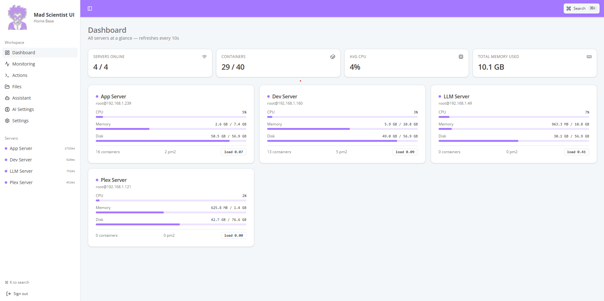
</p>

---

### 📊 Monitoring

<p align="center">
  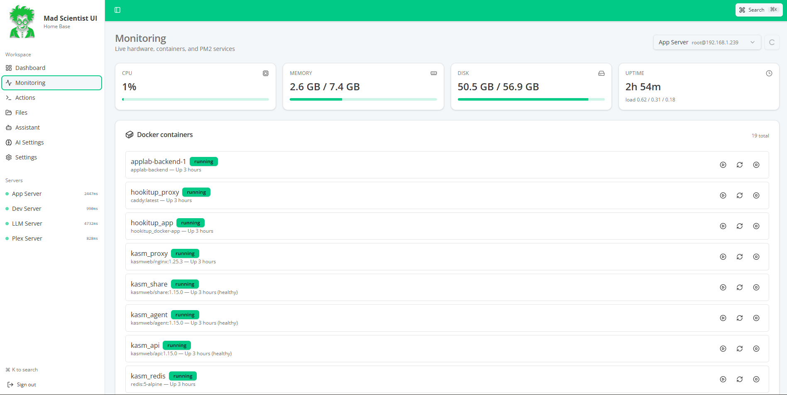
</p>

---

### ⚡ Actions

<p align="center">
  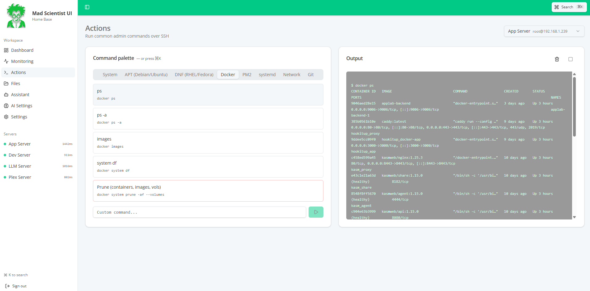
</p>

---

### 📁 File Manager

<p align="center">
  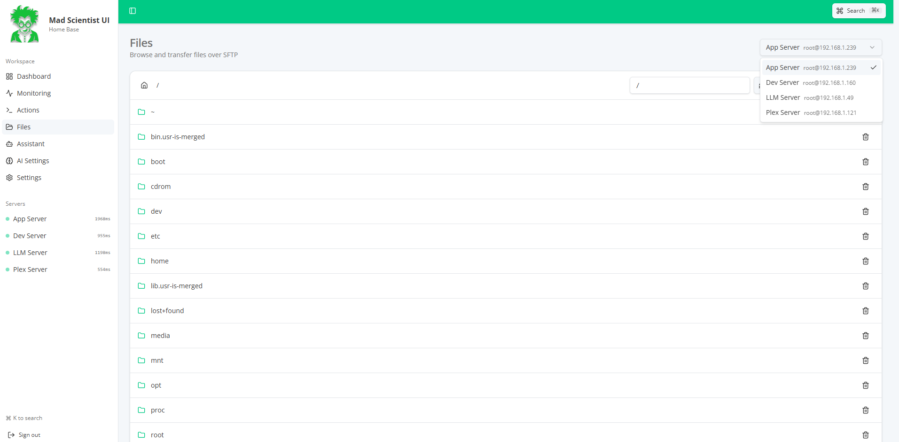
</p>

---

### 🤖 AI Assistant

<p align="center">
  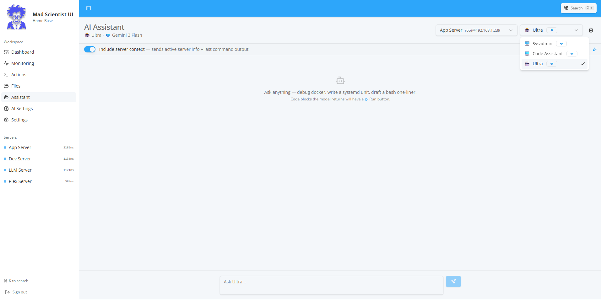
</p>

---

### ⚙️ Settings

<p align="center">
  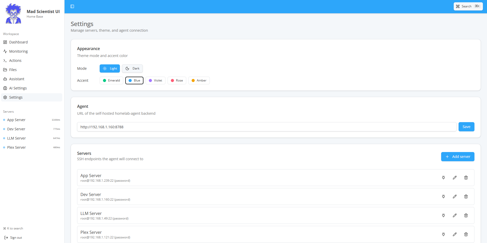
</p>

---

### 🤖 AI Agents

<p align="center">
  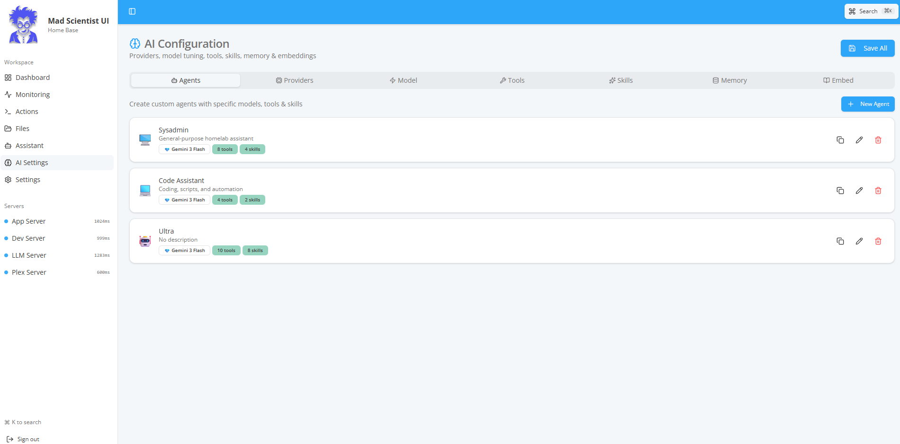
</p>

---

### ☁️ AI Providers

<p align="center">
  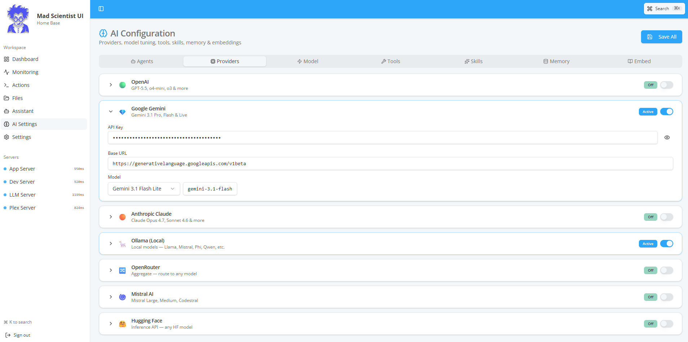
</p>

---

### 🧠 AI Models

<p align="center">
  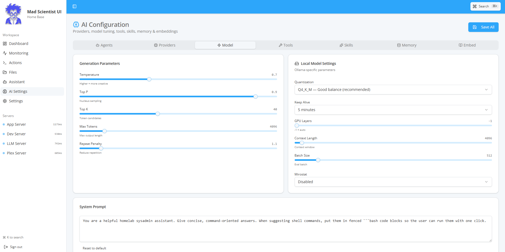
</p>

---

### 🛠️ AI Tools

<p align="center">
  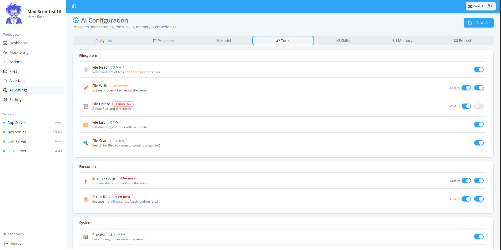
</p>

---

### 🎯 AI Skills

<p align="center">
  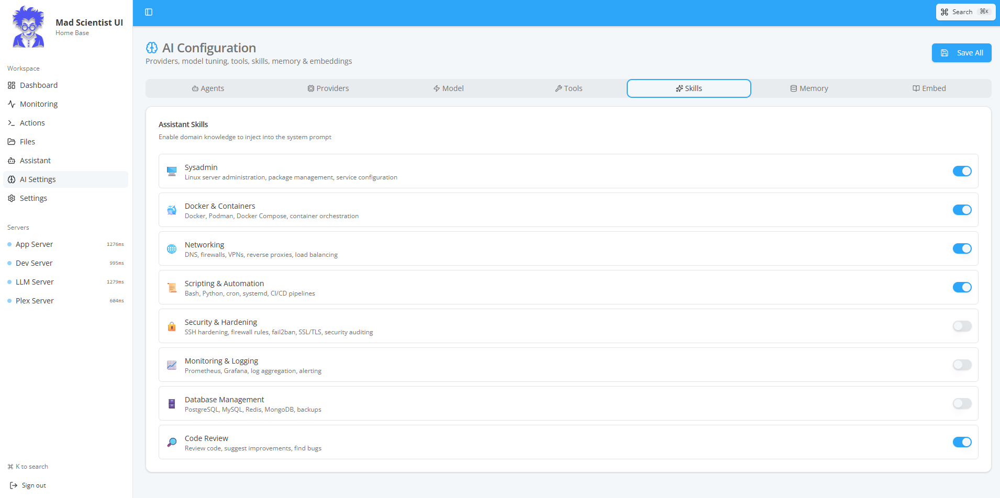
</p>

---

### 🧠 Memory Configuration

<p align="center">
  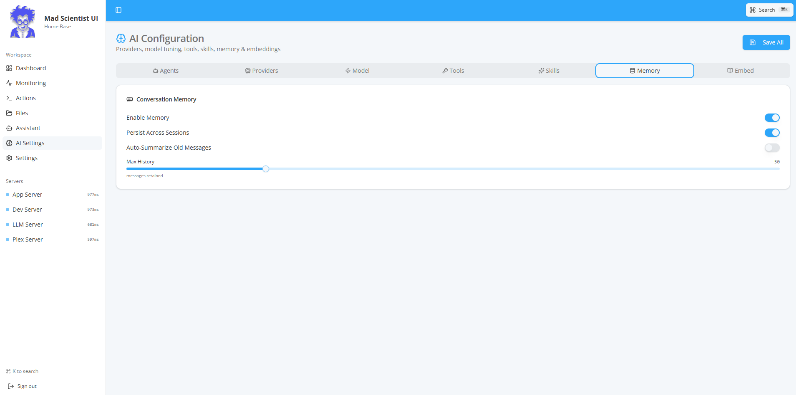
</p>

---

### 📐 Embeddings & RAG

<p align="center">
  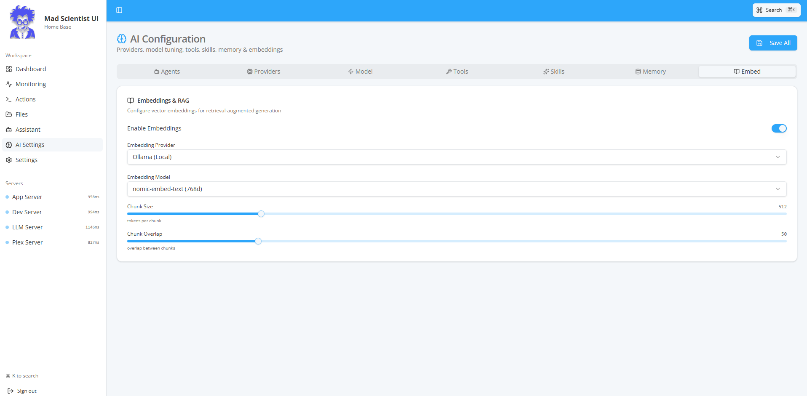
</p>

---

## Table of Contents

- [Overview](#overview)
- [Features](#features)
- [Architecture](#architecture)
- [Tech Stack](#tech-stack)
- [Getting Started](#getting-started)
- [Pages & Modules](#pages--modules)
- [AI System](#ai-system)
- [Theming & Appearance](#theming--appearance)
- [Backend Agent](#backend-agent)
- [Project Structure](#project-structure)
- [Configuration Reference](#configuration-reference)
- [Contributing](#contributing)
- [License](#license)

---

## Overview

MadScientist is a **Homelab Control Center** — a web-based dashboard designed for self-hosters and sysadmins who manage one or more Linux servers. It communicates with a lightweight **homelab-agent** backend service running on your network, which handles SSH connections, Docker/PM2 management, file transfers, and AI model inference.

The frontend is built with React, TanStack Router (file-based routing with SSR support), and styled using the **Datta Able** design system with Tailwind CSS v4. It supports both light and dark themes with multiple accent color presets.

---

## Features

### 🖥️ Server Management

- **Multi-server support** — Add, edit, test, and delete SSH server connections
- **Credential encryption** — SSH passwords and private keys encrypted at rest (AES-256-GCM)
- **Connection testing** — One-click SSH connectivity verification
- **Health monitoring** — Sidebar shows live server status with latency indicators

### 📊 Dashboard

- **At-a-glance overview** — Aggregate stats across all servers
- **Server cards** — CPU, memory, disk utilization with progress bars per server
- **Container counts** — Total and running Docker containers
- **Auto-refresh** — Metrics refresh every 10 seconds

### 📈 Monitoring (per-server)

- **Hardware metrics** — CPU %, memory (used/total), disk (used/total), uptime, load average
- **Docker containers** — List all containers with state, image, status; start/stop/restart controls
- **PM2 processes** — List all PM2 services with CPU, memory, restarts, uptime; start/stop/restart controls
- **Live refresh** — Polls every 5 seconds with manual refresh button

### ⚡ Actions (Remote Command Execution)

- **Command palette** — Pre-built command groups organized by category:
  - **System** — uptime, disk, memory, top processes, kernel info, reboot
  - **APT/DNF** — package management (update, upgrade, autoremove)
  - **Docker** — ps, images, system df, prune
  - **PM2** — list, save, restart all, logs
  - **systemd** — failed units, timers, journal
  - **Network** — IP addresses, listening ports, routes
  - **Git** — status, pull
- **Custom commands** — Free-form shell command input
- **Streamed output** — Real-time SSE-streamed terminal output with scrolling
- **Context sharing** — Last command output is available to the AI assistant

### 📁 File Manager (SFTP)

- **Remote file browser** — Navigate server filesystems with breadcrumb navigation
- **File operations**:
  - Browse directories with size and type info
  - Upload files (multi-file support)
  - Download files via authenticated URLs
  - Create new folders
  - Delete files and directories
- **Path input** — Direct path entry for quick navigation

### 🤖 AI Assistant

- **Multi-agent system** — Create and switch between specialized agents
- **Agent picker** — Select which agent to chat with from the header dropdown
- **Server context injection** — Optionally include active server info and last command output
- **Streamed responses** — Real-time SSE-streamed chat completions
- **Executable code blocks** — Bash code blocks include a ▶ Run button to execute directly on the connected server
- **Destructive command protection** — Pattern-matching detects dangerous commands (rm -rf, mkfs, dd, shutdown, etc.) and requires explicit confirmation
- **Per-server chat history** — Conversations persist per server in localStorage
- **Markdown rendering** — Full GFM support with syntax highlighting

### ⚙️ Settings

- **Appearance** — Light/Dark mode toggle + 5 accent color presets (Emerald, Blue, Violet, Rose, Amber)
- **Agent URL** — Configure the backend homelab-agent endpoint
- **Server CRUD** — Full server management with SSH credential configuration
- **Command palette** — Global `⌘K` / `Ctrl+K` keyboard shortcut for quick navigation

---

## AI System

The AI subsystem is a comprehensive, multi-provider configuration accessible via the **AI Settings** page (`/ai-settings`). All settings persist to `localStorage`.

### 🤖 Agents (Create & Manage)

Create custom AI agents, each with their own:

- **Name, icon, and description**
- **Provider + Model** — Assign any configured provider/model combination
- **System prompt** — Custom instructions for the agent's behavior
- **Tools** — Cherry-pick which tools the agent can use
- **Skills** — Select domain knowledge to inject into the system prompt
- **Temperature & Max Tokens** — Per-agent generation parameters

Three default agents are included:

| Agent | Provider | Model | Purpose |
|-------|----------|-------|---------|
| 🖥️ Sysadmin | Ollama | Llama 3.3 70B | General homelab administration |
| 🐳 Docker Expert | Ollama | Llama 3.3 70B | Container management |
| 💻 Code Assistant | Ollama | Qwen 2.5 Coder | Scripting and automation |

### ☁️ Providers (7 Supported)

| Provider | Auth | Models | Default Base URL |
|----------|------|--------|------------------|
| 🟢 **OpenAI** | API Key | GPT-5.5, o4-mini | `https://api.openai.com/v1` |
| 💎 **Google Gemini** | API Key | Gemini 3.1 Pro/Flash | `https://generativelanguage.googleapis.com/v1beta` |
| 🟠 **Anthropic Claude** | API Key | Claude 4.7 Opus | `https://api.anthropic.com/v1` |
| 🦙 **Ollama (Local)** | None | Auto-detected | `http://localhost:11434` |
| 🔀 **OpenRouter** | API Key | Any (Aggregated) | `https://openrouter.ai/api/v1` |
| 🌀 **Mistral AI** | API Key | Mistral Large 3, Pixtral 2 | `https://api.mistral.ai/v1` |
| 🤗 **Hugging Face** | API Key | DeepSeek V4, Llama 4 | `https://api-inference.huggingface.co` |

Each provider has:

- Toggleable enabled/disabled state
- API key management (with show/hide toggle)
- Customizable base URL (for self-hosted or proxy setups)
- Pre-configured model catalog with context window sizes, tool support, and vision capabilities

### 🔧 Model Settings

**Generation Parameters:**

- Temperature (0–2), Top P (0–1), Top K (1–100)
- Max tokens (256–32768), Repeat penalty (1–2)
- Custom system prompt with reset-to-default

**Local Model Settings (Ollama-specific):**

- **Quantization** — Q4_0, Q4_K_M, Q5_K_M, Q6_K, Q8_0, FP16, FP32
- GPU layers (-1 = auto), Thread count
- Context length (512–131072), Batch size (64–4096)
- Mirostat (disabled / v1 / v2) with tau and eta parameters
- Keep-alive duration (0 / 5m / 30m / 1h / forever)

### 🛠️ Tools (10 Built-in)

Each tool has a danger level and optional confirmation requirement:

| Tool | Category | Danger Level |
|------|----------|-------------|
| 📄 File Read | Filesystem | 🟢 Safe |
| ✏️ File Write | Filesystem | 🟡 Moderate |
| 🗑️ File Delete | Filesystem | 🔴 Dangerous |
| 📁 File List | Filesystem | 🟢 Safe |
| 🔍 File Search | Filesystem | 🟢 Safe |
| ⚡ Shell Execute | Execution | 🔴 Dangerous |
| 📜 Script Run | Execution | 🔴 Dangerous |
| 📊 Process List | System | 🟢 Safe |
| 🐳 Docker Manage | System | 🟡 Moderate |
| 🌐 HTTP Fetch | Network | 🟢 Safe |

### 🎯 Skills (8 Domains)

Toggle domain-specific knowledge that gets injected into the system prompt:

- 🖥️ **Sysadmin** — Linux administration, package management
- 🐳 **Docker & Containers** — Dockerfiles, compose, networking
- 🌐 **Networking** — DNS, firewalls, VPNs, reverse proxies
- 📜 **Scripting & Automation** — Bash, Python, cron, systemd, CI/CD
- 🔒 **Security & Hardening** — SSH, fail2ban, SSL/TLS
- 📈 **Monitoring & Logging** — Prometheus, Grafana, log aggregation
- 🗄️ **Database Management** — PostgreSQL, MySQL, Redis, MongoDB
- 🔎 **Code Review** — Bug detection, code quality, improvements

### 🧠 Memory

- Enable/disable conversation memory
- Configure max conversation history (10–200 messages)
- Session persistence toggle
- Auto-summarization of old messages with configurable threshold

### 📐 Embeddings & RAG

Configure vector embeddings for retrieval-augmented generation:

- **Providers**: OpenAI, Ollama, Hugging Face, Local
- **Models**: Provider-specific embedding models with dimension info
- **Chunking**: Configurable chunk size (128–2048) and overlap (0–256)

---

## Architecture

```
┌─────────────────────────┐         ┌──────────────────────────┐
│   MadScientist UI       │  HTTPS  │    homelab-agent         │
│   (React SPA)           │ ◄─────► │    (Node.js backend)     │
│                         │   API   │                          │
│  • Dashboard            │         │  • SSH connections       │
│  • Monitoring           │         │  • Docker API            │
│  • Actions (SSE)        │         │  • PM2 management        │
│  • File Manager         │         │  • File SFTP ops         │
│  • AI Assistant (SSE)   │         │  • Ollama proxy          │
│  • AI Settings          │         │  • SQLite + AES-256-GCM  │
│  • Settings             │         │  • JWT authentication    │
└─────────────────────────┘         └──────────────┬───────────┘
                                                   │ SSH
                                         ┌─────────┼─────────┐
                                         ▼         ▼         ▼
                                      Server 1  Server 2  Server N
```

---

## Tech Stack

| Layer | Technology |
|-------|-----------|
| **Framework** | React 19 + TanStack Router + TanStack Start (SSR) |
| **State** | TanStack Query (server state) + localStorage (client state) |
| **Styling** | Tailwind CSS v4 + Radix UI primitives (shadcn/ui) |
| **Design System** | Datta Able (Open Sans, #00C853 accent, card shadows) |
| **Icons** | Lucide React |
| **Build** | Vite 7 |
| **Type Safety** | TypeScript 5.8 (strict mode) |
| **Notifications** | Sonner toast library |
| **Charts** | Recharts |
| **Markdown** | react-markdown + remark-gfm |
| **Backend** | Node.js (homelab-agent, separate service) |

---

## Getting Started

### Prerequisites

- **Node.js** 20+ (or Bun)
- **homelab-agent** running on your network (see [Backend Agent](#backend-agent))

### Installation

```bash
# Clone the repository
git clone https://github.com/martin861101/MadScientist_UI.git
cd MadScientist_UI

# Install dependencies
npm install
# or: bun install

# Start the development server
npm run dev
```

The app will be available at `http://localhost:8080`.

### First-time Setup

1. Open the app and you'll see the **Login** page
2. Enter your **Agent URL** (e.g., `http://homelab.local:8788`)
3. Enter the dashboard password configured in your agent's `.env`
4. Navigate to **Settings** → **Add Server** to configure your first SSH server
5. Visit **AI Settings** to configure providers and create agents

> **Demo mode**: Leave the Agent URL blank and use password `admin` to explore the UI without a running agent.

---

## Pages & Modules

| Route | Page | Description |
|-------|------|-------------|
| `/login` | Login | Agent URL + password authentication |
| `/dashboard` | Dashboard | Multi-server overview with aggregate stats |
| `/monitoring` | Monitoring | Per-server hardware, Docker, PM2 metrics |
| `/actions` | Actions | SSH command execution with streamed output |
| `/files` | Files | Remote SFTP file browser with upload/download |
| `/assistant` | AI Assistant | Multi-agent chat with executable code blocks |
| `/ai-settings` | AI Settings | Providers, models, tools, skills, memory, embeddings, agents |
| `/settings` | Settings | Theme, agent URL, server CRUD |

---

## Theming & Appearance

### Color Modes

- **Light mode** — Clean white surfaces (`#f4f7fa` background)
- **Dark mode** — Deep slate surfaces (`#232a3b` background)

### Accent Colors

Five built-in accent presets switchable from Settings:

- 🟢 Emerald (default)
- 🔵 Blue
- 🟣 Violet
- 🌹 Rose
- 🟡 Amber

### Typography

- **Primary font**: Open Sans (300, 400, 600, 700 weights)
- **Monospace**: JetBrains Mono / system monospace stack
- **Heading colors**: `#737373` (light) / `#A7A6A6` (dark)
- **Body text**: `#3A3A3A` (light) / `#E6F5F0` (dark)

---

## Backend Agent

The **homelab-agent** is a separate Node.js service that runs on your homelab network. See [`homelab-agent/README.md`](./homelab-agent/README.md) for full documentation.

### Quick Start (Docker)

```bash
cd homelab-agent
cp .env.example .env  # Edit DASHBOARD_PASSWORD + JWT_SECRET
docker compose up -d
```

### Environment Variables

| Variable | Default | Description |
|----------|---------|-------------|
| `PORT` | `8788` | HTTP listen port |
| `DATA_DIR` | `./data` | SQLite DB + encryption key storage |
| `DASHBOARD_PASSWORD` | `changeme` | Single dashboard password |
| `JWT_SECRET` | `dev-jwt-secret-change-me` | JWT signing secret |
| `OLLAMA_URL` | `http://localhost:11434` | Ollama endpoint for local AI |

### API Surface

```
POST /api/auth/login              → { token }
GET  /api/auth/me                 → { ok: true }

CRUD /api/servers                 Server management
POST /api/servers/:id/test        Connection test

GET  /api/monitor/:id             → { hardware, containers[], pm2[] }
POST /api/monitor/:id/docker/:name/:action
POST /api/monitor/:id/pm2/:name/:action

POST /api/actions/exec            → SSE stream (shell output)

GET  /api/files/:id/list          Directory listing
GET  /api/files/:id/download      File download
POST /api/files/:id/upload        File upload (multipart)
POST /api/files/:id/mkdir         Create directory
POST /api/files/:id/rm            Delete file/directory

GET  /api/ai/models               → { models: [...] }
POST /api/ai/chat                 → SSE stream (chat completion)
```

All routes (except `/api/auth/*` and `/health`) require `Authorization: Bearer <token>`.

### Troubleshooting Permissions

If the dashboard does not display Docker containers or PM2 processes for a server, it's because the SSH user lacks the necessary permissions.

**1. Enabling Docker Monitoring:**
The SSH user must be in the `docker` group to run `docker ps` without sudo. Run this on your server:
```bash
sudo usermod -aG docker $USER
newgrp docker
```
*(You may need to disconnect and reconnect the SSH session for this to take effect.)*

**2. Enabling PM2 Monitoring:**
The dashboard runs `pm2 jlist`. For this to work:
- The SSH user must be the same user that started the PM2 processes.
- PM2 must be in the SSH user's `$PATH` for non-interactive shells. If it's missing, you may need to symlink PM2 into `/usr/local/bin/` or `/usr/bin/`:
  ```bash
  sudo ln -s $(which pm2) /usr/local/bin/pm2
  ```

---

## Project Structure

```
MadScientist_UI/
├── homelab-agent/              # Backend agent (Node.js, separate service)
│   ├── server.js               # Express server with SSH, Docker, PM2 integration
│   ├── docker-compose.yml      # Docker deployment config
│   └── README.md               # Agent-specific documentation
│
├── src/
│   ├── components/
│   │   ├── ui/                 # shadcn/ui primitives (46 components)
│   │   ├── app-sidebar.tsx     # Main navigation sidebar
│   │   ├── command-palette.tsx # Global ⌘K command palette
│   │   ├── empty-state.tsx     # Reusable empty/error state component
│   │   ├── markdown-message.tsx# Markdown renderer with run buttons
│   │   └── server-picker.tsx   # Server selection dropdown
│   │
│   ├── lib/
│   │   ├── agent-client.ts     # HTTP + SSE client for homelab-agent API
│   │   ├── ai-providers.ts     # AI provider config, tools, skills, memory, agents
│   │   ├── auth-context.tsx    # Authentication context (JWT token management)
│   │   ├── chat-context.ts     # Chat history persistence (localStorage)
│   │   ├── theme.tsx           # Theme provider (mode + accent colors)
│   │   └── utils.ts            # Utility helpers (cn, etc.)
│   │
│   ├── routes/
│   │   ├── __root.tsx          # Root layout (HTML shell, meta tags, providers)
│   │   ├── _authenticated.tsx  # Auth guard layout (sidebar, header)
│   │   ├── _authenticated/
│   │   │   ├── dashboard.tsx   # Multi-server overview
│   │   │   ├── monitoring.tsx  # Per-server metrics + Docker/PM2
│   │   │   ├── actions.tsx     # SSH command execution
│   │   │   ├── files.tsx       # SFTP file browser
│   │   │   ├── assistant.tsx   # AI chat interface
│   │   │   ├── ai-settings.tsx # AI configuration (7 tabs)
│   │   │   └── settings.tsx    # App settings + server CRUD
│   │   ├── index.tsx           # Root redirect
│   │   └── login.tsx           # Authentication page
│   │
│   ├── styles.css              # Global CSS (Datta Able design tokens)
│   ├── router.tsx              # TanStack Router instance
│   └── start.ts                # TanStack Start entry point
│
├── STYLE.md                    # Design system reference (Datta Able)
├── package.json                # Dependencies and scripts
├── vite.config.ts              # Vite + TanStack Start configuration
└── tsconfig.json               # TypeScript configuration
```

---

## Configuration Reference

### localStorage Keys

All client-side settings persist in `localStorage` under these keys:

| Key | Description |
|-----|-------------|
| `homelab.agentUrl` | Backend agent URL |
| `homelab.token` | JWT auth token |
| `homelab.theme.mode` | `"dark"` or `"light"` |
| `homelab.theme.accent` | Accent color ID |
| `homelab.lastServer` | Last selected server ID |
| `homelab.lastOutput` | Last command output (for AI context) |
| `homelab.chat.<serverKey>` | Chat history per server |
| `homelab.ai.providers` | Provider configs (API keys, base URLs, models) |
| `homelab.ai.modelSettings` | Generation parameters + local model settings |
| `homelab.ai.tools` | Tool enabled/disabled states |
| `homelab.ai.skills` | Skill enabled/disabled states |
| `homelab.ai.memory` | Memory configuration |
| `homelab.ai.embedding` | Embedding/RAG configuration |
| `homelab.ai.agents` | Custom agent definitions |
| `homelab.ai.activeAgent` | Currently selected agent ID |

### Scripts

```bash
npm run dev       # Start Vite dev server (port 8080)
npm run build     # Production build
npm run preview   # Preview production build
npm run lint      # ESLint check
npm run format    # Prettier format
```

---

## Contributing

1. Fork the repository
2. Create a feature branch (`git checkout -b feature/my-feature`)
3. Commit your changes (`git commit -m 'Add my feature'`)
4. Push to the branch (`git push origin feature/my-feature`)
5. Open a Pull Request

---

## License

This project is private. All rights reserved.
